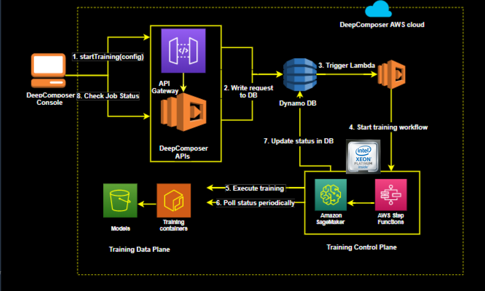

### AWS ML 

accelerate your adoption of machine learning with AWS SageMaker. Models that previously took months and required specialized expertise can now be built in weeks or even days.

*Use Case*

**Challenges with Online Fraud Detection**

* Requires machine learning expertise and fraud domain knowledge
* Fraud teams often lack in-house ML experts
* Rely on  rule-based systems and expensive manual fraud reviews by human investigator/analysts 

**Online Fraud Detection with Amazon Fraud Detector**

* Prebuilt fraud detection model templates
* Automatic creation of custom fraud detection models
* One interface to review past evaluation logic 
* Models learn from past attempts to defraud amazon 
* AWS SageMaker integration

*Use Case*

**Challenges with DevOps Workflow**

* significant human interaction
* expensive and hard to find resources with long implementation cycles
* time-consuming manual analysis

### AWS CodeGuru 
* Automated code reviews with intelligent recommendations
* On-demand and seamless integration with pull request workflow
* Detection and optimization of the most expensive line of code 
* Identification of application inefficiencies 

---

* Supervised Learning: Models are presented wit input data and the desired results. The model will then attempt to learn rules that map the input data to the desired results.

* Unsupervised Learning: Models are presented with datasets that have no labels or predefined patterns, and the model will attempt to infer the underlying structures from the dataset. Generative AI is a type of unsupervised learning.

* Reinforcement learning: The model or agent will interact with a dynamic world to achieve a certain goal. The dynamic world will reward or punish the agent based on its actions. Overtime, the agent will learn to navigate the dynamic world and accomplish its goal(s) based on the rewards and punishments that it has received.

---
### Generative AI 
Generative AI is one of the biggest recent advancements in artificial intelligence technology because of its ability to create something new. It opens the door to an entire world of possibilities for human and computer creativity, with practical applications emerging across industries, from turning sketches into images for accelerated product development, to improving computer-aided design of complex objects. It takes two neural networks against each other to produce new and original digital works based on sample inputs.

> Generative AI technique pits two different neural networks against each other to produce new and original digital works
based on sample inputs 

> Generative AI utilized unsupervised learning 

*Use Case*

**Autodesk - Airbus**

Airbus reimagining multiple structural aircraft components , applying Autodesk generative design to develop lighter weight parts that exceeds
performance and safety standards 

**Autodesk - Nasa JPL**

Exploring new approaches to design and manufacturing processes for space exploration 

**Gildewell Laboratories**
Building crowns that have even more anatomical detail than the original teeth they're replacing 

---

## AWS Composer and Generative AI

AWS DeepComposer uses generative adversarial networks (GAN) , a generative AI technique that puts 2 netowrks against each other
to generate new creative content 

*GANS Metaphors*

Orchestra (Generator)
* doesnt create amazing music 
* generate polished music 

Conductor (Discriminator)
* judges the output and coaches for improvement 

AWS DeepComposer Workflow
1.  Use the AWS DeepComposer keyboard or play the virtual keyboard in the AWS DeepComposer console to input a melody.

2.  Use a model in the AWS DeepComposer console to generate an original musical composition. You can choose from jazz, rock, pop, symphony or Jonathan Coulton pre-trained models or you can also build your own custom genre model in Amazon SageMaker.

3.  Publish your tracks to SoundCloud or export MIDI files to your favorite Digital Audio Workstation (like Garage Band) and get even more creative.

---

### Compose music with AWS DeepComposer 

Input melody using AWS DeepComposer Keyboard
Choose trained model
Output music composition ai generated 

### How AWS DeepComposer uses GAN 

* GANs have generator and discriminator trained for thousands of iterations (epochs). (Each iteration of the training cycle is called an epoch) 
We can monitor the loss functions after many training epochs.
 
* Loss function measure accuracy of the model , how close or accurate the model comes to a desired output. the goal of iterating and completing epochs is to improve the output or prediction of the model. Any output that deviates from the ground truth is referred to as an error. The measure of an error, given a set of weights, is called a loss function. Weights represent how important an associated feature is to determining the accuracy of a prediction, and loss functions are used to update the weights after every iteration. Ideally, as the weights update, the model improves making less and less errors. Convergence happens once the loss functions stabilize.

* GANs have 2 loss functions ( generator loss and discriminator loss)

*  Typical to see GAN loss function fluctuate early , due to adversarial nature of the generator and discriminator. Overtime, the loss function stabilizes to a point which we call convergence. Once the loss functions from the Generator and Discriminator converges, this indicates the GAN model is no longer learning, and we can stop its training. or when the function is stable over many epochs

### AWS DeepComposer under the hood 

1.  Input melody captured on the AWS DeepComposer console
2.  Console makes a backend call to AWS DeepComposer APIs that triggers an execution Lambda.
3.  Book-keeping is recorded in Dynamo DB.
4.  The execution Lambda performs an inference query to SageMaker which hosts the model and the training inference container.
5.  The query is run on the Generative AI model.
6.  The model generates a composition.
7.  The generated composition is returned.
8.  The user can hear the composition in the console.
9.  The user can share the composition to SoundCloud

---
## Measuring Quality 

Similarity Index
* Measure how close the model is at mimicking the style of our data

* When the graph of the similarity index smoothes out and becomes less spikey, we can be confident that the model is converging
* musical quality of the model should improve as the number of training epochs increases.

*   x : Time , y : Epoch
*   the closer the generator comes to the real samples , the index should tends towards 0 (not to become 0)
*   convergence occurs when graph smooth out 
*   model improve over time as ml model trains 

**Challenges in Training GANs**

* Clean datasets are hard to obtain
* GANs take time to converge during training
* Complexity in defining subjective metrics for music creation ( in defining what constitutes a good music)
* Complexity in defining quantitative metrics for music creation ( in defining genre, or good/bad music )

### Training Architecture 

1.  User launch a training job from the AWS DeepComposer console by selecting 
2.   hyperparameters and data set filtering tags
3. The backend consists of an API Layer (API gateway and lambda) write request to DynamoDB
4. Triggers a lambda function that starts the training workflow
5. It then uses AWS Step Funcitons to launch the training job on Amazon SageMaker
6. Status is continually monitored and updated to DynamoDB
7. The console continues to poll the backend for the status of the training job and update the results live so users can see how the model is learning

### Generative AI 

Generative AI opens the door to an entire world of creative possibilities with practical applications emerging across industries, from turning sketches into images for accelerated product development, to improving computer-aided design of complex objects.

* Use Case

Glidewell Dental is training a generative adversarial network adept at constructing detailed 3D models from images. One network generates images and the second inspects those images. This results in an image that has even more anatomical detail than the original teeth they are replacing.
    * training gpu powered GANs to create dental crown models

Generative AI enables computers to learn the underlying pattern associated with a provided input (image, music, or text), and then they can use that input to generate new content. Examples of Generative AI techniques include Generative Adversarial Networks (GANs), Variational Autoencoders, and Transformers.

### GAN

GANs, a generative AI technique, pit 2 networks against each other to generate new content. The algorithm consists of two competing networks: a generator and a discriminator.

*   A generator is a convolutional neural network (CNN) that learns to create new data resembling the source data it was trained on.

*   The discriminator is another convolutional neural network (CNN) that is trained to differentiate between real and synthetic data.

The generator and the discriminator are trained in alternating cycles such that the generator learns to produce more and more realistic data while the discriminator iteratively gets better at learning to differentiate real data from the newly created data.

* use case

metaphor of an orchestra and conductor. An orchestra doesn’t create amazing music the first time they get together. They have a conductor who both judges their output, and coaches them to improve

* The generator and discriminator are occuring asynchronously
* The generator is learning to produce more realistic data and the discriminator is learning to differentiate real data from the newly create data 

**Generator**
The generator network used in AWS DeepComposer is adapted from the U-Net architecture, a popular convolutional neural network that is used extensively in the computer vision domain. The network consists of an “encoder” that maps the single track music data (represented as piano roll images) to a relatively lower dimensional “latent space“ and a ”decoder“ that maps the latent space back to multi-track music data.

* The generator takes in a batch of single-track piano rolls (melody) as the input and generates a batch of multi-track piano rolls as the output by adding accompaniments to each of the input music tracks.
* The discriminator then takes these generated music tracks and predicts how far it deviates from the real data present in your training dataset.

**Discriminator**
The goal of the discriminator is to provide feedback to the generator about how realistic the generated piano rolls are, so that the generator can learn to produce more realistic data. The discriminator provides this feedback by outputting a scalar value that represents how “real” or “fake” a piano roll is.

Since the discriminator tries to classify data as “real” or “fake”, it is not very different from commonly used binary classifiers. We use a simple architecture for the critic, composed of four convolutional layers and a dense layer at the end.

* This feedback from the discriminator is used by the generator to update its weights. As the generator gets better at creating music accompaniments, it begins fooling the discriminator. So, the discriminator needs to be retrained as well.
* Beginning with the discriminator on the first iteration, we alternate between training these two networks until we reach some stop condition (ex: the algorithm has seen the entire dataset a certain number of times).

1. Input
2. Encoder
3. Latent Space
4. Decoder
5. Output

* Finer control of AWS DeepComposer with hyperparameters
hyperparameters for finer control of this process. Here are a few details on each to help guide your exploration.
    * is set before training process

* number of epoch
When the training loop has passed through the entire training dataset once, we call that one epoch. Training for a higher number of epochs will mean your model will take longer to complete its training task, but it may produce better output if it has not yet converged. You will learn how to determine when a model has completed most of its training in the next section.

* Learning Rate

The learning rate controls how rapidly the weights and biases of each network are updated during training. A higher learning rate might allow the network to explore a wider set of model weights, but might pass over more optimal weights.

* Update ratio

A ratio of the number of times the discriminator is updated per generator training epoch. Updating the discriminator multiple times per generator training epoch is useful because it can improve the discriminators accuracy. Changing this ratio might allow the generator to learn more quickly early-on, but will increase the overall training time.

While we provide sensible defaults for these hyperparameters in the AWS DeepComposer console, you are encouraged to explore other settings to see how each changes your model’s performance and time required to finish training your model.

**Evaluation**

Typically when training any sort of model, it is a standard practice to monitor the value of the loss function throughout the duration of the training. The discriminator loss has been found to correlate well with sample quality. You should expect the discriminator loss to converge to zero and the generator loss to converge to some number which need not be zero. When the loss function plateaus, it is an indicator that the model is no longer learning. At this point, you can stop training the model. You can view these loss function graphs in the AWS DeepComposer console.

* Sample output quality improves with more training

After 400 epochs of training, discriminator loss approaches near zero and the generator converges to a steady-state value. Loss is useful as an evaluation metric since the model will not improve as much or stop improving entirely when the loss plateaus.

sample output at 400 epochs features elements of training dataset 

