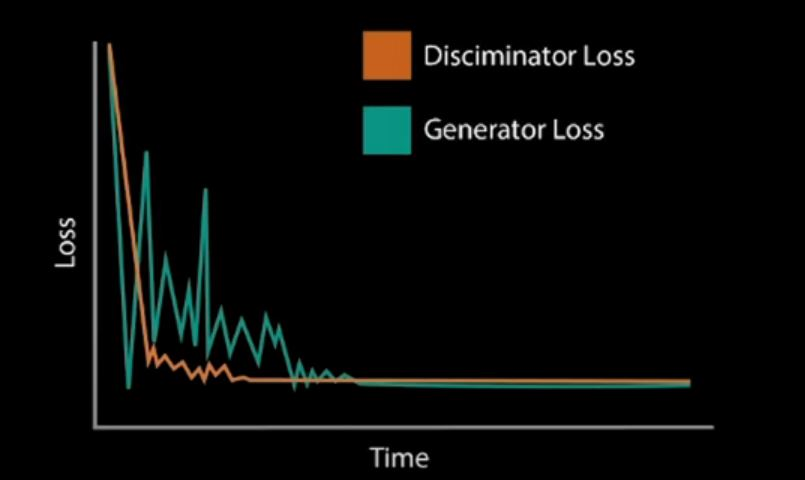

### AWS ML 

accelerate your adoption of machine learning with AWS SageMaker. Models that previously took months and required specialized expertise can now be built in weeks or even days.

*Use Case*

**Challenges with Online Fraud Detection**

* Requires machine learning expertise and fraud domain knowledge
* Fraud teams often lack in-house ML experts
* Rely on  rule-based systems and expensive manual fraud reviews by human investigator/analysts 

**Online Fraud Detection with Amazon Fraud Detector**

* Prebuilt fraud detection model templates
* Automatic creation of custom fraud detection models
* One interface to review past evaluation logic 
* Models learn from past attempts to defraud amazon 
* AWS SageMaker integration

*Use Case*

**Challenges with DevOps Workflow**

* significant human interaction
* expensive and hard to find resources with long implementation cycles
* time-consuming manual analysis

### AWS CodeGuru 
* Automated code reviews with intelligent recommendations
* On-demand and seamless integration with pull request workflow
* Detection and optimization of the most expensive line of code 
* Identification of application inefficiencies 

---

* Supervised Learning: Models are presented wit input data and the desired results. The model will then attempt to learn rules that map the input data to the desired results.

* Unsupervised Learning: Models are presented with datasets that have no labels or predefined patterns, and the model will attempt to infer the underlying structures from the dataset. Generative AI is a type of unsupervised learning.

* Reinforcement learning: The model or agent will interact with a dynamic world to achieve a certain goal. The dynamic world will reward or punish the agent based on its actions. Overtime, the agent will learn to navigate the dynamic world and accomplish its goal(s) based on the rewards and punishments that it has received.

---
### Generative AI 
Generative AI is one of the biggest recent advancements in artificial intelligence technology because of its ability to create something new. It opens the door to an entire world of possibilities for human and computer creativity, with practical applications emerging across industries, from turning sketches into images for accelerated product development, to improving computer-aided design of complex objects. It takes two neural networks against each other to produce new and original digital works based on sample inputs.

> Generative AI technique pits two different neural networks against each other to produce new and original digital works
based on sample inputs 

> Generative AI utilized unsupervised learning 

*Use Case*

**Autodesk - Airbus**

Airbus reimagining multiple structural aircraft components , applying Autodesk generative design to develop lighter weight parts that exceeds
performance and safety standards 

**Autodesk - Nasa JPL**

Exploring new approaches to design and manufacturing processes for space exploration 

**Gildewell Laboratories**
Building crowns that have even more anatomical detail than the original teeth they're replacing 

---

## AWS Composer and Generative AI

AWS DeepComposer uses generative adversarial networks (GAN) , a generative AI technique that puts 2 netowrks against each other
to generate new creative content 

*GANS Metaphors*

Orchestra (Generator)
* doesnt create amazing music 
* generate polished music 

Conductor (Discriminator)
* judges the output and coaches for improvement 

AWS DeepComposer Workflow
1.  Use the AWS DeepComposer keyboard or play the virtual keyboard in the AWS DeepComposer console to input a melody.

2.  Use a model in the AWS DeepComposer console to generate an original musical composition. You can choose from jazz, rock, pop, symphony or Jonathan Coulton pre-trained models or you can also build your own custom genre model in Amazon SageMaker.

3.  Publish your tracks to SoundCloud or export MIDI files to your favorite Digital Audio Workstation (like Garage Band) and get even more creative.

---

### Compose music with AWS DeepComposer 

Input melody using AWS DeepComposer Keyboard
Choose trained model
Output music composition ai generated 

### How AWS DeepComposer uses GAN 

* GANs have generator and discriminator trained for thousands of iterations (epochs). (Each iteration of the training cycle is called an epoch) 
We can monitor the loss functions after many training epochs.
 
* Loss function measure accuracy of the model , how close or accurate the model comes to a desired output. the goal of iterating and completing epochs is to improve the output or prediction of the model. Any output that deviates from the ground truth is referred to as an error. The measure of an error, given a set of weights, is called a loss function. Weights represent how important an associated feature is to determining the accuracy of a prediction, and loss functions are used to update the weights after every iteration. Ideally, as the weights update, the model improves making less and less errors. Convergence happens once the loss functions stabilize.

* GANs have 2 loss functions ( generator loss and discriminator loss)

*  Typical to see GAN loss function fluctuate early , due to adversarial nature of the generator and discriminator. Overtime, the loss function stabilizes to a point which we call convergence. Once the loss functions from the Generator and Discriminator converges, this indicates the GAN model is no longer learning, and we can stop its training. or when the function is stable over many epochs

### AWS DeepComposer under the hood 

1.  Input melody captured on the AWS DeepComposer console
2.  Console makes a backend call to AWS DeepComposer APIs that triggers an execution Lambda.
3.  Book-keeping is recorded in Dynamo DB.
4.  The execution Lambda performs an inference query to SageMaker which hosts the model and the training inference container.
5.  The query is run on the Generative AI model.
6.  The model generates a composition.
7.  The generated composition is returned.
8.  The user can hear the composition in the console.
9.  The user can share the composition to SoundCloud

---
## Measuring Quality 

Similarity Index
* Measure how close the model is at mimicking the style of our data

*   x : Time , y : Epoch
*   the closer the generator comes to the real samples , the index should tends towards 0 
*   convergence occurs when graph smooth out 