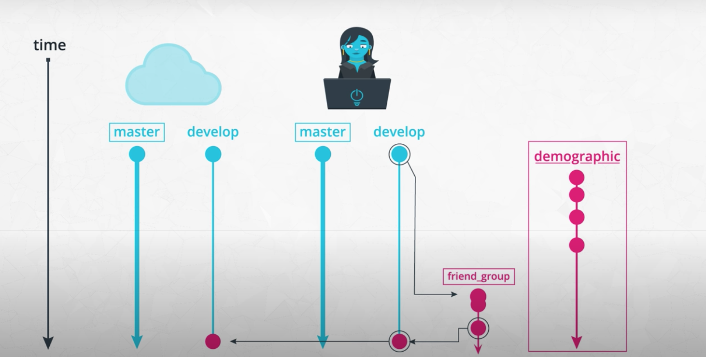
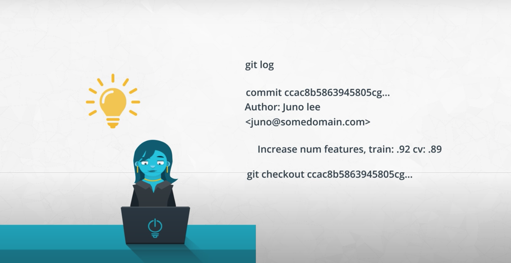
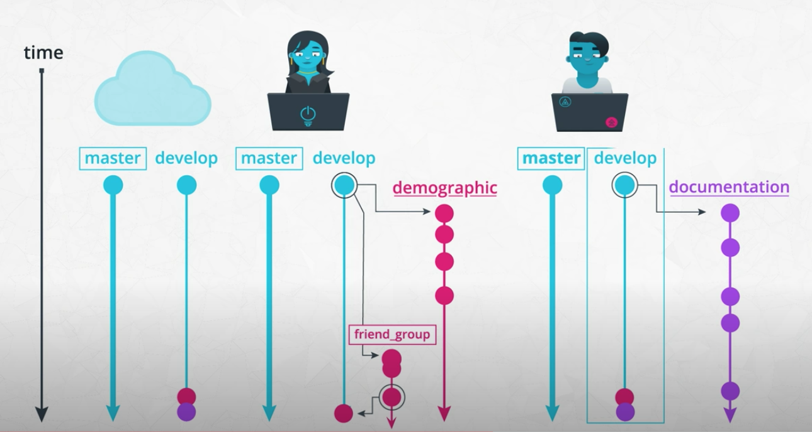
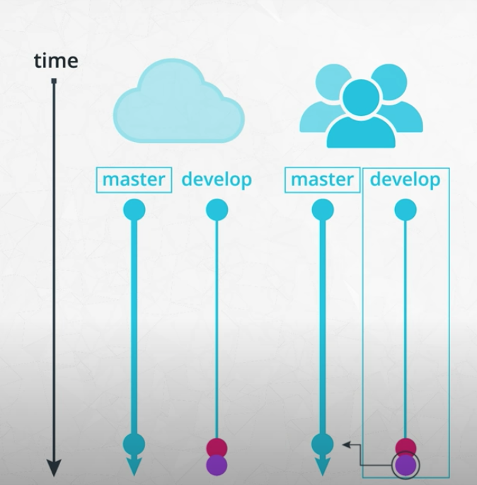

# Software Engineering Practices

* Clean and modular code
* Code efficiency
* Documentation
* Version Control

## Clean
Readable , simple, consise

## Modular
* functions
* modules
* reuse
* dry 
* fewer arg,parameter

## Refactoring
Which function to modularize
Restructure code to improve internal structure w/o changing external functionality

* Reduce workload
* Easy to maintain
* Reuse
* Better developer

## Writing clean code
 * DRY - dont repeat yourself
 * 4 indent
 * blank
 * 79 char pep 8
 
 ## Efficient code
 refactor to improve efficiency to make it clean and modular 
 
 objective
 * reduce run time
 * reduce space in memory
 
 **Optimizing Code**
 
 sets faster than lists [sets over lists](https://stackoverflow.com/questions/8929284/what-makes-sets-faster-than-lists/8929445#8929445)
 ```
import time
 
with open('all_books_published.txt') as f:
   recent_books = f.read().split('\n')
   
with open('all_coding_blocks') as f:
   coding_books = f.read().split('\n')
   
start = time.time()
recent_coding_books = []

for book in recent_books:
 if book in coding_books:
   recent_coding_books.append(book)
  
 'Duration: {} seconds'.format(time.time()-start())
 ```
 
## Documentation
Additional text or illustrations that comes with or is embedded in software code
[Doc string Ref](https://www.python.org/dev/peps/pep-0257/)
[Doc string Numpy Guide](https://numpydoc.readthedocs.io/en/latest/format.html)

* Clarify complex parts of code
* Navigate code easily
* Describe use and purpose of components

**Types of Documentaions**
* Line level
    * In-line comments
    * clarifying complex code
    * readable code is prefer over having comments
* Function or module level
    * Docstring explain function or module 
    * add whatever details in docstring
* Project level
    * for getting others to understand why and how your code is relevant to them, whether they are potentials users of your project or developers who may contribute to your code. 
    
    * At a minimum, this should explain what it does, list its dependencies, and provide sufficiently detailed instructions on how to use it. You want to make it as simple as possible for others to understand the purpose of your project, and quickly get something working.


## Git 
[Git Branching Strategy](https://nvie.com/posts/a-successful-git-branching-model/)

[Git Merge Conflicts](https://help.github.com/en/github/collaborating-with-issues-and-pull-requests/about-merge-conflicts)

**Scenario 1**




STEP 1: You have a local version of this repository on your laptop, and to get the latest stable version, you pull from the develop branch.
```
git checkout develop
git pull
```
STEP 2: When you start working on this demographic feature, you create a new branch for this called demographic, and start working on your code in this branch.
```
git checkout -b demographic
git commit -m 'added gender recommendations'
...
```
STEP 3: However, in the middle of your work, you need to work on another feature. So you commit your changes on this demographic branch, and switch back to the develop branch.
```
git checkout develop
```
STEP 4: From this stable develop branch, you create another branch for a new feature called friend_groups.
```
git checkout -b friend_groups
```
STEP 5: After you finish your work on the friend_groups branch, you commit your changes, switch back to the development branch, merge it back to the develop branch, and push this to the remote repository’s develop branch.
```
git checkout develop
git merge --no-ff friends_groups
git push origin develop
```
STEP 6: Now, you can switch back to the demographic branch to continue your progress on that feature
```
git checkout demographic
```
**Scenario 2**



Step 1: You check your commit history, seeing messages of the changes you made and how well it performed.
```
git log
```


Step 2: The model at this commit seemed to score the highest, so you decide to take a look.
```
git checkout bc90f2cbc9dc4e802b46e7a153aa106dc9a88560
```
Step 3: Now, you’re pretty confident merging this back into the development branch, and pushing the updated recommendation engine.
```
git checkout develop
git merge --no-ff friend_groups
git push origin develop
```


**Scenario 3**





Step 1: Andrew commits his changes to the documentation branch, switches to the development branch, and pulls down the latest changes from the cloud on this development branch, including the change I merged previously for the friends group feature.

```
git commit -m "standardized all docstrings in process.py"
git checkout develop
git pull
```
Step 2: Then, Andrew merges his documentation branch on the develop branch on his local repository, and then pushes his changes up to update the develop branch on the remote repository.

```
git merge --no-ff documentation
git push origin develop
```

Step 3: After the team reviewed both of your work, they merge the updates from the development branch to the master branch. Now they push the changes to the master branch on the remote repository. These changes are now in production.

```
git merge --no-ff develop
git push origin master
```

## Model versioning

each commit was documented with a score for that model. This is one simple way to help you keep track of model versions. Version control in data science can be tricky, because there are many pieces involved that can be hard to track, such as large amounts of data, model versions, seeds, hyperparameters, etc.
 
[Version Control for Production ML](https://algorithmia.com/blog/how-to-version-control-your-production-machine-learning-models)


